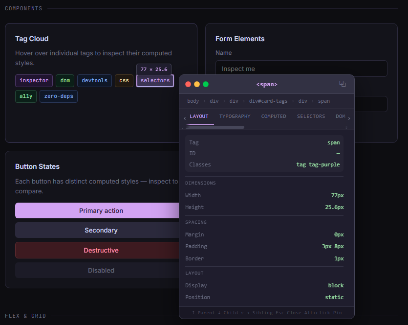
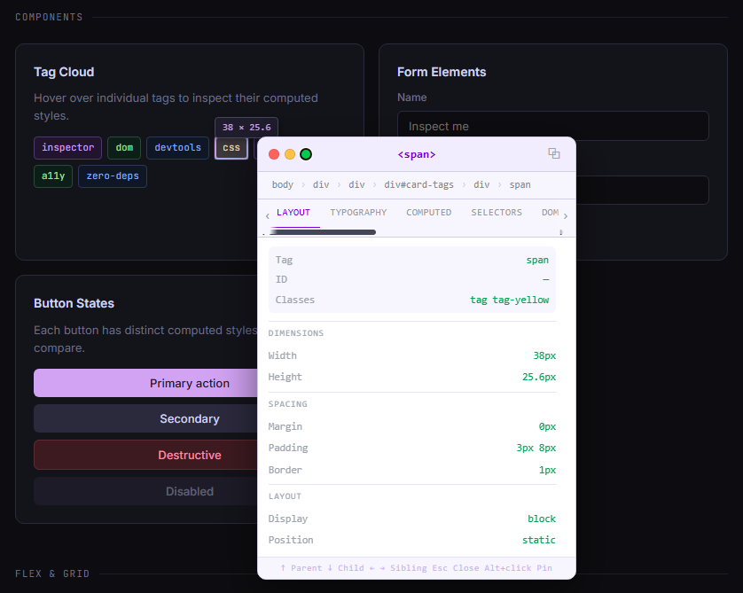

# @armvs/dom-inspector

Lightweight, framework-agnostic DOM Inspector inspired by browser DevTools.

[](https://www.npmjs.com/package/@armvs/dom-inspector)
[](https://www.npmjs.com/package/@armvs/dom-inspector)
[](LICENSE)
[](https://www.typescriptlang.org/)
[](https://playwright.dev/)


---

🚀 [Live Demo](https://sayataleqsanyan.github.io/dom-inspector/) · 📦 [npm](https://www.npmjs.com/package/@armvs/dom-inspector) · 📖 [Documentation](#api) · ⭐ [GitHub](https://github.com/sayataleqsanyan/dom-inspector)

---

Inspect elements, visualize the CSS box model, navigate the DOM tree, copy selectors, and debug layouts directly on any webpage — without opening browser DevTools.

---

## Installation

### npm

```bash
npm install @armvs/dom-inspector
```

### pnpm

```bash
pnpm add @armvs/dom-inspector
```

### yarn

```bash
yarn add @armvs/dom-inspector
```

---

## Usage

### ES Module (Vite / Nuxt / Rollup / Webpack 5)

```js
import DOMInspector from '@armvs/dom-inspector';
import '@armvs/dom-inspector/css';

DOMInspector.init(true);
```

### Named imports (tree-shakeable)

```js
import { init, enable, disable, destroy } from '@armvs/dom-inspector';
import '@armvs/dom-inspector/css';

init(true);
```

### CommonJS (Node.js / require)

```js
const DOMInspector = require('@armvs/dom-inspector');

DOMInspector.init(true);
```

### TypeScript

```ts
import DOMInspector, { InspectorOptions, ExportData } from '@armvs/dom-inspector';
import '@armvs/dom-inspector/css';

const options: InspectorOptions = {
  triggerKey:    'Alt',
  freezeOnClick: false,
  theme:         'dark',
};

DOMInspector.init(options);
```

> TypeScript support is built-in — no `@types/` package needed.
> IntelliSense works automatically in VSCode and any TypeScript-aware editor.

### CSS import

Import the stylesheet separately so your bundler can process or tree-shake it:

```js
// In JS / TS entry point
import '@armvs/dom-inspector/css';

// Or in a CSS / SCSS file
@import '@armvs/dom-inspector/dist/inspector.min.css';
```

---

## Quick Start

### Always Enabled

```js
DOMInspector.init(true);
```

### Disabled

```js
DOMInspector.init(false);
```

### Local Development Only

```js
DOMInspector.init(
  () => location.hostname === 'localhost'
);
```

### Admin Users Only

```js
DOMInspector.init(
  () => window.isAdmin === true
);
```

---

## CDN Usage

```html
<link
  rel="stylesheet"
  href="https://cdn.jsdelivr.net/npm/@armvs/dom-inspector/dist/inspector.min.css"
/>

<script src="https://cdn.jsdelivr.net/npm/@armvs/dom-inspector/dist/inspector.min.js"></script>

<script>
  DOMInspector.init(true);
</script>
```

---

## Highlights

- 🔍 Inspect any element in real time
- 📦 Visual CSS Box Model visualization
- 🌳 Interactive DOM tree with breadcrumbs
- 🎯 Automatic CSS selector & XPath generation
- 📋 One-click selector copy
- ♿ WCAG Accessibility auditing
- 📐 Flexbox & Grid inspection panels
- 🧩 Framework detection (React, Vue, Angular)
- 🌑 Dark & Light themes (4 variants)
- 🔭 Shadow DOM support
- ⚡ Zero runtime dependencies
- 🧪 Unit tested with Vitest + E2E with Playwright

---

## Why DOM Inspector?

When debugging production environments, admin panels, staging deployments, embedded widgets, or client websites, opening DevTools is not always convenient.

DOM Inspector provides a lightweight in-page inspection experience that can be enabled only for specific users, environments, or conditions.

| | Chrome DevTools | DOM Inspector |
|---|---|---|
| Production safe | ❌ Not accessible to end users | ✅ Embeds in your app |
| Admin-only access | ❌ Requires browser access | ✅ Condition-based init |
| End users can use it | ❌ | ✅ |
| Customizable trigger | ❌ | ✅ Alt / Ctrl / Meta / Shift |
| Zero setup for users | ❌ | ✅ |

### Ideal Use Cases

* Admin-only debugging tools
* Internal QA environments
* Staging deployments
* CMS development
* Design system validation
* Layout troubleshooting
* Production-safe inspection tools

---

## Advanced Configuration

```js
DOMInspector.init({
  enabled: true,
  theme: 'dark',           // 'dark' | 'light' | { ... }
  triggerKey: 'Alt',       // 'Alt' | 'Control' | 'Meta' | 'Shift'
  freezeOnClick: false,
  headerStyle: 'traffic',  // 'traffic' | 'classic'
});
```

---

## API

### Initialization

```js
DOMInspector.init(true);

DOMInspector.init(false);

DOMInspector.init(
  () => location.hostname === 'localhost'
);
```

### Methods

| Method | Description |
| --- | --- |
| `init(options)` | Initialize inspector with options or boolean |
| `enable()` | Enable inspector at runtime |
| `disable()` | Disable inspector at runtime |
| `destroy()` | Remove inspector completely and clean up |
| `export(format)` | Export inspection data — `'json'` \| `'html'` \| `'markdown'` \| `'yaml'` |
| `audit(element)` | Run WCAG accessibility audit on element |
| `on(event, fn)` | Subscribe to inspector events |

### Events

```js
// Subscribe to events
DOMInspector.on('inspect', ({ element, selector, xpath }) => {
  console.log('Inspecting:', selector);
});

// Export current element data
const data = DOMInspector.export('json'); // 'json'|'html'|'markdown'|'yaml'

// Run accessibility audit
const issues = DOMInspector.audit(document.querySelector('button'));
```

### Runtime Controls

```js
DOMInspector.enable();

DOMInspector.disable();

DOMInspector.destroy();
```

---

## Framework Examples

### React

```jsx
import { useEffect } from 'react';
import DOMInspector from '@armvs/dom-inspector';

import '@armvs/dom-inspector/dist/inspector.css';

function App() {
  useEffect(() => {
    DOMInspector.init({
      enabled: process.env.NODE_ENV === 'development',
      theme: 'dark',
    });
  }, []);

  return <div>Application</div>;
}
```

### Vue

```js
import { onMounted } from 'vue';
import DOMInspector from '@armvs/dom-inspector';

onMounted(() => {
  DOMInspector.init({
    enabled: import.meta.env.DEV,
    theme: 'dark',
  });
});
```

### Angular

```ts
import DOMInspector from '@armvs/dom-inspector';

constructor() {
  DOMInspector.init({
    enabled: !environment.production,
    theme: 'dark',
  });
}
```

### Laravel

```blade
<script src="{{ asset('vendor/inspector/inspector.js') }}"></script>

<script>
DOMInspector.init(
    {{ auth()->user()?->isAdmin() ? 'true' : 'false' }}
);
</script>
```

### Dynamic Laravel Authorization

```blade
<body data-inspector="{{ auth()->user()?->isAdmin() ? '1' : '0' }}">

<script>
DOMInspector.init(
  () => document.body.dataset.inspector === '1'
);
</script>
```

---

## Keyboard Shortcuts

| Shortcut | Action |
| --- | --- |
| Alt + Hover | Inspect element |
| Alt + Click | Pin inspector |
| Esc | Close inspector |
| Drag Header | Move panel |
| 📌 | Pin panel |
| ⧉ | Copy selector |

---

## Testing

Run unit tests:

```bash
npm test
```

Run end-to-end tests:

```bash
npm run test:e2e
```

---

## Browser Support

| Browser | Supported |
| --- | --- |
| Chrome | ✅ |
| Firefox | ✅ |
| Edge | ✅ |
| Safari | ✅ |

---

## Security

DOM Inspector is designed to be safe for production usage.

* Uses `textContent` instead of `innerHTML`
* Safely ignores restricted cross-origin stylesheets
* Handles clipboard failures gracefully
* Cleans up all event listeners on `destroy()`
* Removes injected DOM nodes completely
* Adds no runtime overhead when disabled

---

## Screenshots

<p align="center">
  
  <br><br>
  
</p>

---

## Version History

### v4.x

* Standalone JavaScript library
* Browser extension support
* Improved inspection workflow
* Enhanced testing coverage

---

## License

MIT License

Copyright (c) Sayat
